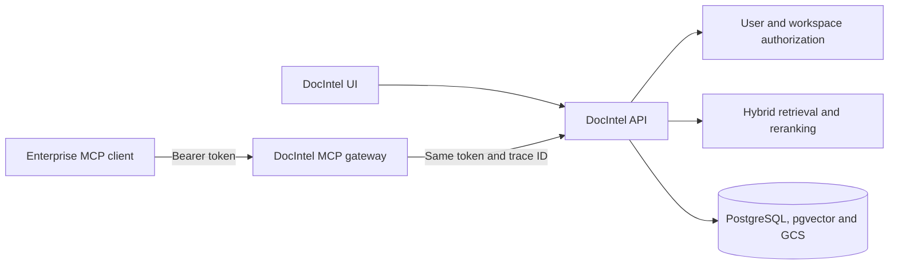

# DocIntel MCP architecture

The MCP gateway is a separately deployable adapter over the existing DocIntel
API. It does not connect to PostgreSQL, pgvector, or GCS directly.

## Trust boundaries

1. Cloud Run exposes the MCP protocol endpoint; an API gateway can add quotas,
   abuse protection, and OAuth discovery without consuming the DocIntel token.
2. The MCP gateway requires a DocIntel bearer token for every private tool and
   resource operation.
3. The DocIntel API validates that token and enforces resource ownership and
   workspace membership.
4. Tool arguments such as `workspace_id` and `document_id` are selectors, never
   authorization evidence.

## Delivery sequence

1. Read-only knowledge and session MVP.
2. OAuth resource-server discovery and service-account onboarding.
3. Standard and signed large-file ingestion with idempotency.
4. Speech/video timeline resources and asynchronous processing status.
5. Governed vertical workflows and packet resources.
6. Quotas, policy enforcement, OpenTelemetry, and conformance testing.
